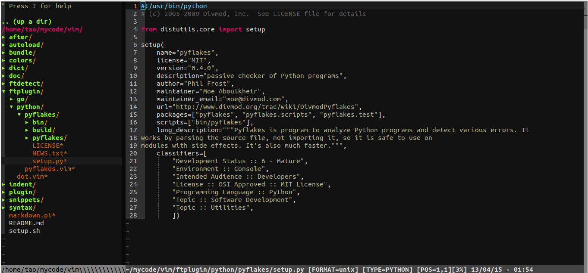

# [我的Vim配置](http://tao12345666333.github.com/vim)
[](https://travis-ci.org/tao12345666333/vim)

## 截图



## 安装
(你需要一个有Python支持的Vim版本. 请使用 `vim --version | grep +python` 来检查)

* **依赖**(Debian/Ubuntu 平台)

    `sudo apt-get install python vim exuberant-ctags git`

    `sudo pip install dbgp pep8 flake8 pyflakes isort`

* **依赖**(RedHat/CentOS 平台)

    CentOS 6.7的yum源自带的Python版本较旧，推荐自行安装Python2.7.

    `sudo yum install python vim ctags git`

    `sudo pip install dbgp pep8 flake8 pyflakes isort`

* **依赖**(Mac OS 平台)

    `brew install python vim git`

    `wget http://tenet.dl.sourceforge.net/project/ctags/ctags/5.8/ctags-5.8.tar.gz && tar -zxvf ctags-5.8.tar.gz && cd ctags-5.8 && ./configure && make && sudo make install`

    `sudo pip install dbgp pep8 flake8 pyflakes isort`

* **下载vimrc 文件到用户主目录**

    `wget https://raw.githubusercontent.com/tao12345666333/vim/master/vimrc -O $HOME/.vimrc`

* **打开 Vim**

    打开Vim, 它将会自动安装插件. 请耐心等待它完成. 或者你可以使用下面的命令来自行安装.

    `vim -E -u $HOME/.vimrc +qall`

* **享受你的Vim并个性化它吧!**

## 支持特性

### 插件管理（Vundle）

在这份配置中，使用了[**Vundle**](https://github.com/VundleVim/Vundle.vim)作为插件管理器. Vundle会自动接管 `.vim` 文件夹，所有配置好的插件将默认下载至`~/.vim/bundle/`， 在使用之前请确保`.vim`文件夹干净. Vundle的插件安装需要触发 `git clone` 操作，搜索需要 `curl` 支持.

#### 配置(截取了部分)

```vim
" let Vundle manage Vundle
Plugin 'gmarik/vundle'

" ============================================================================
" Active plugins
" You can disable or add new ones here:

" Plugins from github repos:

" Better file browser
Plugin 'scrooloose/nerdtree'
" Code commenter
Plugin 'scrooloose/nerdcommenter'
" Class/module browser
Plugin 'majutsushi/tagbar'
" Code and files fuzzy finder
Plugin 'kien/ctrlp.vim'
" Extension to ctrlp, for fuzzy command finder
Plugin 'fisadev/vim-ctrlp-cmdpalette'
" Zen coding
Plugin 'mattn/emmet-vim'
" Git integration
Plugin 'motemen/git-vim'
" Tab list panel
Plugin 'kien/tabman.vim'

```

#### 支持操作

|      命令             |         解释          |
|-----------------------|:---------------------:|
|  :PluginList          |   列出所有Plugin      |
|  :PluginInstall(!)    |   安装/更新Plugin     |
|  :PluginSearch(!) foo |  搜索foo相关的Plugin  |
|  :PluginClean(!)      |  清理未使用的Plugin   |
|  :PluginUpdate        |      更新插件         |


### 工程文件浏览（NERDTree）

在这份配置中, 使用了[**NERDTree**](https://github.com/scrooloose/nerdtree)查看文件列表. 你可以在NERDTree中浏览和打开你文件系统中的目录或文件. 还可以进行文件隐藏和过滤, 设置添加书签等. 在NERDTree窗口输入`?`可获得操作指南. 这份配置中默认过滤掉了`.pyc`, `.git`, `.hg`, `.svn`等文件或文件夹的显示.

#### 配置

```vim
" auto open or close NERDTree
autocmd vimenter * if !argc() | NERDTree | endif
autocmd bufenter * if (winnr("$") == 1 && exists("b:NERDTreeType") && b:NERDTreeType == "primary") | q | endif

" NERDTree -----------------------------

" toggle nerdtree display
map <F3> :NERDTreeToggle<CR>
" open nerdtree with the current file selected
nmap ,t :NERDTreeFind<CR>
" don;t show these file types
let NERDTreeIgnore = ['\.pyc$', '\.pyo$']
```

#### 支持操作

|      快捷键           |         解释               |
|-----------------------|:--------------------------:|
|      F3               |   打开/关闭NERDTree        |
|      ,t               |打开NERDTree并选中当前文件  |


### 语法检查
在这份配置中， 使用[**Syntastic**](https://github.com/scrooloose/syntastic)插件进行语法静态检查. 包括但不限于`C/C++/Go/Python/Haskell/Ruby/JavaScript`等. 在本配置中对JavaScript的静态检查使用`eslint`,可以支持ES6及JSX等, 细节可以参考[JSLint, JSHint和ESLint的对比及Vim配置](http://moelove.info/2015/11/28/JSLint-JSHint-ESLint%E5%AF%B9%E6%AF%94%E5%92%8CVim%E9%85%8D%E7%BD%AE/), 想要切换检查工具只要修改对应位置即可.

#### 配置

```vim
" Syntastic ------------------------------

" show list of errors and warnings on the current file
nmap <leader>e :Errors<CR>
" turn to next or previous errors, after open errors list
nmap <leader>n :lnext<CR>
nmap <leader>p :lprevious<CR>
" check also when just opened the file
let g:syntastic_check_on_open = 1
" syntastic checker for javascript.
" eslint is the only tool support JSX.
" If you don't need write JSX, you can use jshint.
" And eslint is slow, but not a hindrance
" let g:syntastic_javascript_checkers = ['jshint']
let g:syntastic_javascript_checkers = ['eslint']
" don't put icons on the sign column (it hides the vcs status icons of signify)
let g:syntastic_enable_signs = 0
" custom icons (enable them if you use a patched font, and enable the previous 
" setting)
let g:syntastic_error_symbol = '✗'
let g:syntastic_warning_symbol = '⚠'
let g:syntastic_style_error_symbol = '✗'
let g:syntastic_style_warning_symbol = '⚠'
```

#### 特性

保存时自动进行语法静态检查，方便的错误提示及灵活的可扩展性.

#### 支持操作

|      快捷键           |         解释               |
|-----------------------|:--------------------------:|
|       `\e`            |    打开错误列表            |
|       `\n`            |    移动到下一个错误位置    |
|       `\p`            |    移动到上一个错误位置    |


### Git支持

在这份配置中, 使用[**vim-fugitive**](https://github.com/tpope/vim-fugitive)和[**vim-signify**](https://github.com/mhinz/vim-signify)做Git方面的支持. 可以进行常用的git操作及优雅的状态提示等(目前支持`git`和`hg`).

#### 配置

```vim
" Signify ------------------------------

" this first setting decides in which order try to guess your current vcs
" UPDATE it to reflect your preferences, it will speed up opening files
let g:signify_vcs_list = [ 'git', 'hg' ]
" mappings to jump to changed blocks
nmap <leader>sn <plug>(signify-next-hunk)
nmap <leader>sp <plug>(signify-prev-hunk)
" nicer colors
highlight DiffAdd           cterm=bold ctermbg=none ctermfg=119
highlight DiffDelete        cterm=bold ctermbg=none ctermfg=167
highlight DiffChange        cterm=bold ctermbg=none ctermfg=227
highlight SignifySignAdd    cterm=bold ctermbg=237  ctermfg=119
highlight SignifySignDelete cterm=bold ctermbg=237  ctermfg=167
highlight SignifySignChange cterm=bold ctermbg=237  ctermfg=227
```

#### 支持操作

|      快捷键           |         解释               |
|-----------------------|:--------------------------:|
|    :Git [args]        |      类似执行`git`命令一样 |
|    :Gstatus           |类似`git status`.在列表中使用`-`添加/移除文件       |
|    :Gcommit [args]    |      类似 `git commit`     |
|    :Gmerge [args]     |      类似 `git merge`      |
|    :Gpull [args]      |      类似 `git pull`       |
|    :Gpush [args]      |      类似 `git push`       |
|    :Gvdiff [revision] |类似 `git push` 但是会切分窗口|

更多详细的操作可以使用 `:help fugitive`


### Tag支持

在这份配置中，使用了[**Tagbar**](http://github.com/majutsushi/tagbar)做Tag支持，可以显示当前文件中定义的类/变量等.

#### 配置

```vim
" Tagbar -----------------------------

" toggle tagbar display
map <F4> :TagbarToggle<CR>
" autofocus on tagbar open
let g:tagbar_autofocus = 1
```

#### 支持操作

|      快捷键           |         解释               |
|-----------------------|:--------------------------:|
|       F4              |     打开Tag列表            |


### 超全自动补全

在这份配置中, 使用了[**Neocomplcache**](https://github.com/Shougo/neocomplcache.vim)作为主要的自动补全插件.

#### 配置

```vim
" NeoComplCache ------------------------------

" most of them not documented because I'm not sure how they work
" (docs aren't good, had to do a lot of trial and error to make 
" it play nice)

" Disable AutoComplPop.
let g:acp_enableAtStartup = 0
" Use neocomplcache.
let g:neocomplcache_enable_at_startup = 1
let g:neocomplcache_enable_ignore_case = 1
" Use smartcase.
let g:neocomplcache_enable_smart_case = 1
let g:neocomplcache_enable_auto_select = 1

let g:neocomplcache_enable_fuzzy_completion = 1
let g:neocomplcache_enable_camel_case_completion = 1
let g:neocomplcache_enable_underbar_completion = 1
let g:neocomplcache_fuzzy_completion_start_length = 1
let g:neocomplcache_auto_completion_start_length = 1
let g:neocomplcache_manual_completion_start_length = 1
" Set minimum syntax keyword length.
let g:neocomplcache_min_keyword_length = 1
let g:neocomplcache_min_syntax_length = 1
let g:neocomplcache_lock_buffer_name_pattern = '\*ku\*'
" complete with workds from any opened file
let g:neocomplcache_same_filetype_lists = {}
let g:neocomplcache_same_filetype_lists._ = '_'
" <TAB>: completion.
inoremap <expr><TAB>  pumvisible() ? "\<C-n>" : "\<TAB>"
" Define keyword.
if !exists('g:neocomplcache_keyword_patterns')
    let g:neocomplcache_keyword_patterns = {}
endif
let g:neocomplcache_keyword_patterns['default'] = '\h\w*'
" Plugin key-mappings.
inoremap <expr><C-g>     neocomplcache#undo_completion()
inoremap <expr><C-l>     neocomplcache#complete_common_string()
" <C-h>, <BS>: close popup and delete backword char.
inoremap <expr><C-h> neocomplcache#smart_close_popup()."\<C-h>"
inoremap <expr><BS> neocomplcache#smart_close_popup()."\<C-h>"
inoremap <expr><C-y>  neocomplcache#close_popup()
inoremap <expr><C-e>  neocomplcache#cancel_popup()
```

#### 支持操作

|      快捷键           |         解释               |
|-----------------------|:--------------------------:|
|      \<Tab>           | 使用Tab键进行待提示项目选择|
|      \<C-g>           |    取消补全                |
|      \<C-l>           | 完成待补全项中共同的字符串 |
|      \<C-h>           |     关闭待选项             |
|      \<C-y>           |     关闭待选项             |
|      \<C-e>           |     退出待选项             |
|      \<BS>            |     关闭待选项             |


### 类Tmux的窗口选择

在这份配置中，使用了[**vim-choosewin**](https://github.com/t9md/vim-choosewin)进行窗口管理器. 支持类Tmux的操作.

#### 配置

```vim
" Window Chooser ------------------------------

" mapping
nmap  -  <Plug>(choosewin)
" show big letters
let g:choosewin_overlay_enable = 1
```

#### 支持操作

|      快捷键           |         解释               |
|-----------------------|:--------------------------:|
|       -               |       开启窗口选择         |
|     -  [              |   选择上一个tab的窗口      |
|     -  ]              |   选择下一个tab的窗口      |

更多操作可以使用 `:help choosewin`


### 灵活的Tab管理

在这份配置中使用了[TabMan](https://github.com/kien/tabman.vim)进行Tab管理,可以进行灵活切换与管理

#### 配置

```vim
" TabMan ------------------------------

" mappings to toggle display, and to focus on it
let g:tabman_toggle = 'tl'
let g:tabman_focus  = 'tf'
```

#### 支持操作

|      快捷键           |         解释               |
|-----------------------|:--------------------------:|
|       tl              |     开启/关闭tab管理       |
|       tf              |   将光标移动到tab管理窗口  |


### 优雅的状态栏

在这份配置中，使用了[**Airline**](https://github.com/vim-airline/vim-airline)提供更多状态栏支持.

#### 配置

```vim
" Airline ------------------------------

let g:airline_powerline_fonts = 1
let g:airline_theme = 'bubblegum'
"let g:airline#extensions#tabline#enabled = 1
"let g:airline#extensions#tabline#left_sep = ' '
"let g:airline#extensions#tabline#left_alt_sep = '|'
let g:airline#extensions#whitespace#enabled = 1

" to use fancy symbols for airline, uncomment the following lines and use a
" patched font (more info on the README.rst)
if !exists('g:airline_symbols')
   let g:airline_symbols = {}
endif

let g:airline_left_sep = ''
let g:airline_left_alt_sep = ''
let g:airline_right_sep = ''
let g:airline_right_alt_sep = ''
let g:airline_symbols.branch = ''
let g:airline_symbols.readonly = ''
let g:airline_symbols.linenr = ''
```

#### 支持特性

可以显示分支，语法静态检查结果等.


### 自动插入头部

在这份配置中写了个小函数根据新建的不同类型的文件，自动插入头部，支持`python`, `ruby`, `bash`等.


### Markdown实时预览

在这份配置中, 使用了[**vim-instant-markdown**](https://github.com/suan/vim-instant-markdown)和[vim-markdown](https://github.com/plasticboy/vim-markdown)做Markdown格式的支持，可以支持实时预览等特性.

此功能需要有node环境支持，可以执行 `npm -g install instant-markdown-d` 进行安装.

#### 配置

```vim
" Vim-markdown ------------------------------

" Disabled automatically folding
let g:vim_markdown_folding_disabled=1
" LeTeX math
let g:vim_markdown_math=1
" Highlight YAML frontmatter
let g:vim_markdown_frontmatter=1

" Vim-instant-markdown -----------------

" If it takes your system too much, you can specify
" let g:instant_markdown_slow = 1
" if you don't want to manually control it
" you can open this setting
" and when you open this, you can manually trigger preview
" via the command :InstantMarkdownPreview
let g:instant_markdown_autostart = 0
```

#### 支持操作

|      快捷键           |         解释               |
|-----------------------|:--------------------------:|
|:InstantMarkdownPreview| 手动触发markdown文件的预览 |


### 多游标选择、编辑等

在这份配置中, 可以在高亮某单词时, 通过使用 `Ctrl-n` 或者 `Ctrl-p` 进行多游标选择, 然后进行编辑或修改等操作.


### 快速文件查找

在这份配置中, 可以通过使用`,R`进行全文查找或者`,r`进行快速查找, 或者在当前字符串上使用`,wR`以及`,wr`来进行全文查找或者快速查找.

### 快速注释

使用[**NERDCommenter**](https://github.com/scrooloose/nerdcommenter)插件完成快速注释, 可以通过`\ci`进行快速注释.

#### Python 支持

完备的Python支持, 可以自动识别当前是系统环境或虚拟环境, 使用`:Isort`可智能对导入包进行排序, 使用`:PymodeLintAuto`可自动格式化.

**除了上述列出的功能以外, 还有很多方便的特性，可以大大提升效率，在使用中慢慢体会吧！有问题可以在[tao12345666333/vim](https://github.com/tao12345666333/vim) on github 提issue**
